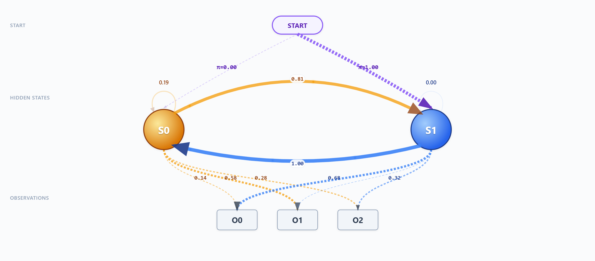
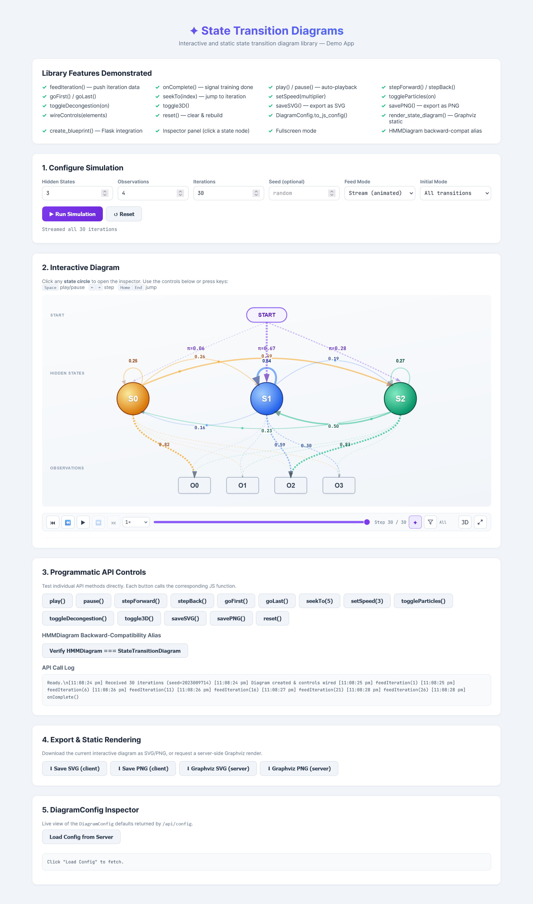
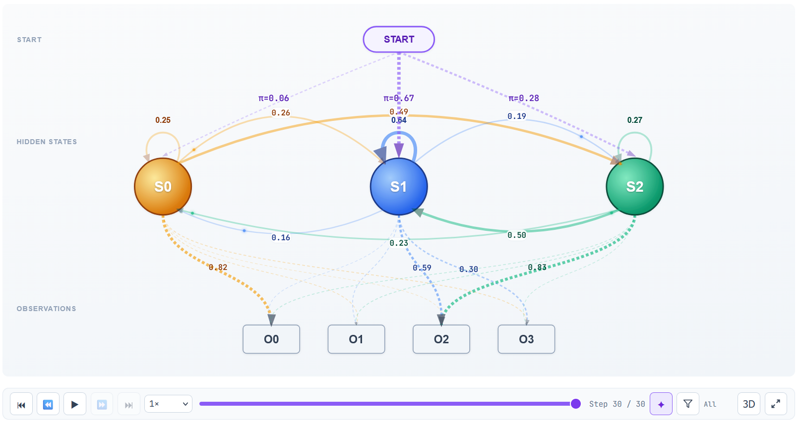
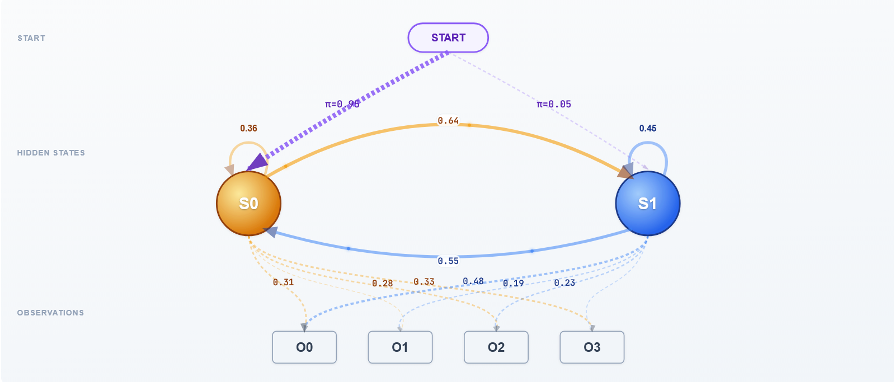
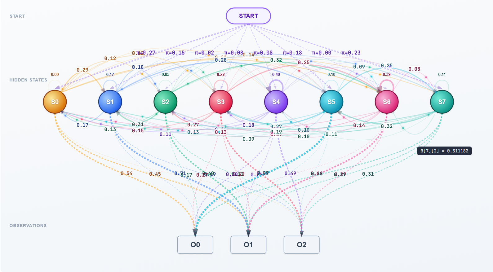
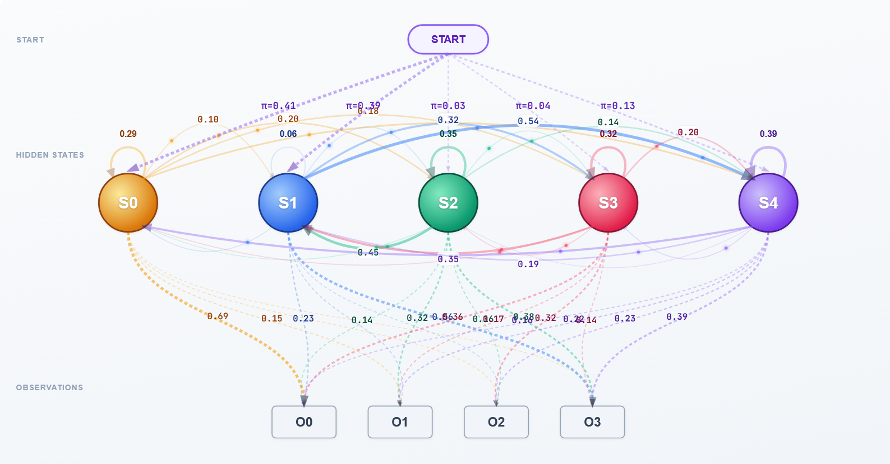
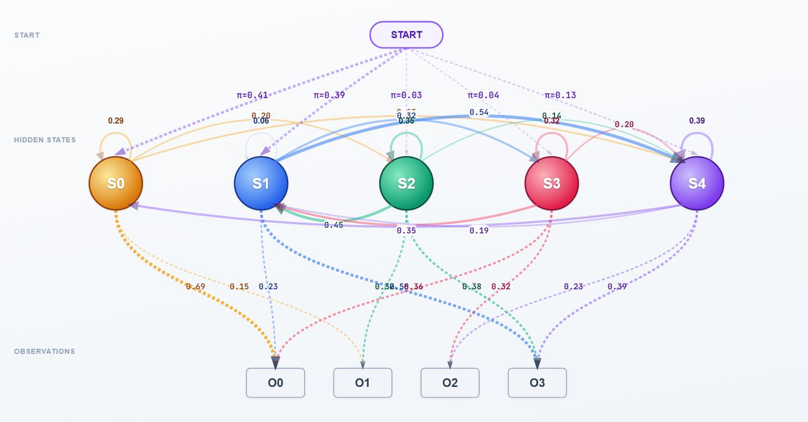
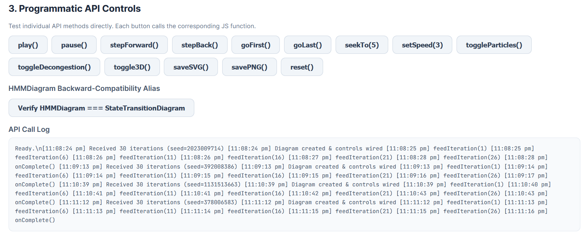
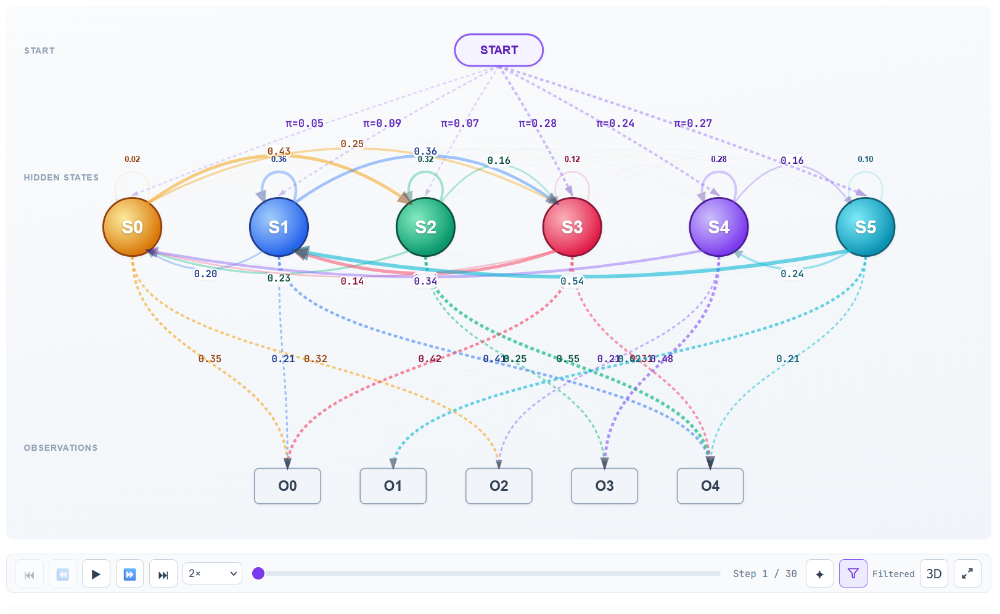

# State Transition Diagrams

An open-source Python + JavaScript library for creating **interactive** and **static** state transition diagrams — ideal for Hidden Markov Models (HMMs), finite-state machines (FSMs), Markov chains, and any stateful system.

---

## Features

| Feature | Description |
|---|---|
| **Interactive D3.js diagram** | Animated 3-tier layout (Start → States → Observations) with particle flow, replay controls, and an inspector panel |
| **Transition de-congestion toggle** | Switch between filtered mode (reduced clutter) and all-transitions mode (all edges visible with spread curvature) |
| **Static Graphviz renderer** | Publication-quality SVG / PNG / PDF diagrams via Graphviz |
| **Flask integration** | Drop-in Flask blueprint to serve the JS/CSS assets |
| **Fully configurable** | Colours, fonts, layout, thresholds, and animation parameters via `DiagramConfig` |
| **Zero lock-in** | Use only the JS/CSS for a pure-frontend solution, or combine with Python for server-side rendering |

---

## Media

### Images










### Videos
<video title="Demo 10" width="640" controls muted loop playsinline>
    <source src="media/10.mp4" type="video/mp4" />
    Your browser does not support the video tag.
</video>

<video title="Demo 11" width="640" controls muted loop playsinline>
    <source src="media/11.mp4" type="video/mp4" />
    Your browser does not support the video tag.
</video>

---

## Installation


```bash
# Core (interactive JS + static renderer)
pip install state-transition-diagrams

# With Graphviz support
pip install state-transition-diagrams[graphviz]

# With Flask integration
pip install state-transition-diagrams[flask]

# Everything
pip install state-transition-diagrams[all]
```

> **Note:** For the Graphviz renderer you also need the [Graphviz system binary](https://graphviz.org/download/).

---

## Development

### Running the Test App

To see the interactive diagram in action without installing the package:

1. Clone the repository.
2. Install dependencies:
   ```bash
   pip install flask
   # and other dependencies listed in pyproject.toml
   ```
3. Run the test app:
   ```bash
   python test_app/app.py
   ```
4. Open http://localhost:5000 in your browser.

---

## Quick Start

### 1. Static Diagram (Python + Graphviz)

```python
import numpy as np
from state_transition_diagrams import render_state_diagram, DiagramConfig

# Transition matrix
A = np.array([
    [0.7, 0.3],
    [0.4, 0.6],
])

# Render with default settings
dot = render_state_diagram(A, state_labels=["Rainy", "Sunny"])
dot.render("my_diagram", format="svg", cleanup=True)

# Or with custom config
cfg = DiagramConfig(
    state_colors=["#E74C3C", "#3498DB"],
    title="Weather Model",
    background_color="#FFFFFF",
    font_family="Arial",
    decongestion_enabled=False,  # OFF by default: show all transitions
    layout_engine="dot",      # try: circo, neato, fdp
    output_format="png",
    prob_threshold=0.05,
)
dot = render_state_diagram(A, state_labels=["Rainy", "Sunny"], config=cfg)
```

### 2. Interactive Diagram (JavaScript + D3.js)

Include the CSS and JS in your HTML page (D3.js v7+ required):

```html
<link rel="stylesheet" href="state_diagram.css">
<script src="https://d3js.org/d3.v7.min.js"></script>
<script src="state_diagram.js"></script>
```

Create the diagram container and controls:

```html
<div id="diagram-container" class="std-canvas"></div>

<div class="std-controls mt-4">
    <button id="btn-first" class="std-ctrl-btn" disabled>⏮</button>
    <button id="btn-back"  class="std-ctrl-btn" disabled>⏪</button>
    <button id="btn-play"  class="std-ctrl-btn" disabled>▶</button>
    <button id="btn-fwd"   class="std-ctrl-btn" disabled>⏩</button>
    <button id="btn-last"  class="std-ctrl-btn" disabled>⏭</button>
    <select id="speed-select" class="std-speed-select">
        <option value="0.25">0.25×</option>
        <option value="0.5">0.5×</option>
        <option value="1" selected>1×</option>
        <option value="2">2×</option>
        <option value="5">5×</option>
    </select>
    <input id="timeline" class="std-timeline" type="range" min="0" max="0" value="0">
    <span id="iter-label" class="std-iter-label">No data</span>
    <button id="btn-particles" class="std-ctrl-btn active">✦</button>
    <button id="btn-decongestion" class="std-ctrl-btn"
            title="Filtered mode (ON): keeps top 2 emissions per hidden state + emissions >= 0.35; weaker lines are thinner/fainter; labels shown for stronger prominent emissions (> 0.08). All mode (OFF): shows all transitions with varied arc radius to reduce overlap.">⫶</button>
</div>

<div id="inspector" class="std-inspector mt-4"></div>
```

Initialise with JavaScript:

```javascript
// Create with default config
const diagram = new StateTransitionDiagram('#diagram-container', '#inspector');

// Or with custom config
const diagram = new StateTransitionDiagram('#diagram-container', '#inspector', {
    stateColors: [
        { base: '#E74C3C', light: '#FADBD8', dark: '#922B21', grad: ['#EC7063', '#CB4335'] },
        { base: '#3498DB', light: '#AED6F1', dark: '#1B4F72', grad: ['#5DADE2', '#2E86C1'] },
    ],
    obsColor: { fill: '#F9EBEA', stroke: '#E74C3C', dark: '#922B21' },
    piColor:  { fill: '#EBF5FB', stroke: '#3498DB', dark: '#1B4F72' },
    particlesEnabled: true,
    decongestionEnabled: false,
    animationSpeed: 1,
});

// Wire up controls
diagram.wireControls({
    btnFirst:    document.getElementById('btn-first'),
    btnBack:     document.getElementById('btn-back'),
    btnPlay:     document.getElementById('btn-play'),
    btnForward:  document.getElementById('btn-fwd'),
    btnLast:     document.getElementById('btn-last'),
    speedSelect: document.getElementById('speed-select'),
    timeline:    document.getElementById('timeline'),
    iterLabel:   document.getElementById('iter-label'),
    btnParticles: document.getElementById('btn-particles'),
    btnDecongestion: document.getElementById('btn-decongestion'),
});

// Feed data (e.g., from a WebSocket or REST API)
diagram.feedIteration({
    A: [[0.7, 0.3], [0.4, 0.6]],
    B: [[0.1, 0.4, 0.5], [0.6, 0.3, 0.1]],
    pi: [0.6, 0.4],
    iteration: 1,
    log_likelihood: -45.23,
});

// Call when training is finished
diagram.onComplete();
```

### 3. Flask Integration

```python
from flask import Flask
from state_transition_diagrams import create_blueprint

app = Flask(__name__)

# Register the blueprint — assets served at /std/css/... and /std/js/...
app.register_blueprint(create_blueprint(), url_prefix="/std")
```

Then in your Jinja template:

```html
<link rel="stylesheet" href="/std/css/state_diagram.css">
<script src="/std/js/state_diagram.js"></script>
```

---

## Configuration Reference

### `DiagramConfig` (Python)

| Parameter | Type | Default | Description |
|---|---|---|---|
| `state_colors` | `list[str]` | 8 colours | Hex colours for state nodes (Graphviz) |
| `interactive_state_colors` | `list[dict]` | 12 rich colours | `{base, light, dark, grad}` for the interactive diagram |
| `observation_fill` | `str` | `#F1F5F9` | Observation node background |
| `observation_stroke` | `str` | `#94A3B8` | Observation node border |
| `observation_text` | `str` | `#334155` | Observation label text colour |
| `start_fill` | `str` | `#F5F3FF` | Start node background |
| `start_stroke` | `str` | `#8B5CF6` | Start node border |
| `start_text` | `str` | `#5B21B6` | Start node text colour |
| `background_color` | `str` | `#FAFAFA` | Graph background |
| `font_family` | `str` | `Helvetica` | Primary font |
| `mono_font_family` | `str` | `JetBrains Mono, monospace` | Monospace font |
| `title` | `str` | `State Transition Diagram` | Graph title |
| `prob_threshold` | `float` | `0.01` | Hide edges below this probability |
| `edge_color` | `str` | `#333333` | Default edge colour |
| `node_shape` | `str` | `circle` | Graphviz node shape |
| `node_radius` | `float` | `40.0` | Base radius for interactive state nodes |
| `layout_engine` | `str` | `circo` | Graphviz engine (`circo`, `dot`, `neato`, `fdp`) |
| `output_format` | `str` | `svg` | Output format (`svg`, `png`, `pdf`) |
| `particles_enabled` | `bool` | `True` | Enable particle animation |
| `decongestion_enabled` | `bool` | `False` | Enable de-congestion filtering (when `False`, all transitions are shown) |
| `animation_speed` | `float` | `1.0` | Playback speed multiplier |

### JavaScript Config Object

Pass as the third argument to `new StateTransitionDiagram(container, inspector, config)`:

```javascript
{
    stateColors: [{ base, light, dark, grad: [from, to] }, ...],
    obsColor:    { fill, stroke, dark },
    piColor:     { fill, stroke, dark },
    particlesEnabled: true,
    decongestionEnabled: false,
    animationSpeed: 1,
    fontFamily: "'Inter', system-ui, sans-serif",
    monoFontFamily: "'JetBrains Mono', monospace",
}
```

---

## JavaScript API

| Method | Description |
|---|---|
| `feedIteration(data)` | Push a new iteration `{ A, B, pi, iteration, log_likelihood }` |
| `onComplete()` | Signal that training/iteration sequence is done |
| `play()` / `pause()` | Start/stop auto-playback |
| `stepForward()` / `stepBack()` | Move one step |
| `goFirst()` / `goLast()` | Jump to first/last iteration |
| `seekTo(index)` | Jump to a specific iteration |
| `setSpeed(multiplier)` | Set playback speed |
| `toggleParticles(on)` | Enable/disable particle animation |
| `toggleDecongestion(on)` | Enable/disable de-congestion filtering mode |
| `toggle3D()` | Toggle 3D perspective view |
| `wireControls(elements)` | Connect DOM controls |
| `reset()` | Clear all data and rebuild |

---

## CSS Classes

| Class | Description |
|---|---|
| `.std-canvas` | Main diagram container |
| `.std-controls` | Replay control bar |
| `.std-ctrl-btn` | Control button |
| `.std-speed-select` | Speed dropdown |
| `.std-timeline` | Timeline range slider |
| `.std-iter-label` | Iteration counter label |
| `.std-inspector` | Expandable inspector panel |

> **Backward compatibility:** The `hmm-*` prefixed classes are also supported for drop-in replacement.

---

## Project Structure

```
state_transition_diagrams/
├── __init__.py              # Package exports
├── config.py                # DiagramConfig dataclass
├── renderer.py              # Graphviz static renderer
├── flask_blueprint.py       # Flask blueprint for serving assets
├── pyproject.toml           # Package metadata
├── LICENSE                  # MIT License
├── README.md                # This file
└── static/
    ├── css/
    │   └── state_diagram.css
    └── js/
        └── state_diagram.js
```

---

## Contributing

1. Fork the repository
2. Create a feature branch (`git checkout -b feature/my-feature`)
3. Commit your changes
4. Push to the branch
5. Open a Pull Request

---

## License

[MIT](LICENSE)
